AIT: Lab 04 - Docker
===

> Auteurs : Benoit Julien – Sütcü Volkan

## Table of content

[*Introduction*](#Introduction)

*[Task 0: Identify issues and install the tools](#task-0)*

*[Task 1: Add a process supervisor to run several processes](#task-1)*

*[Task 2: Add a tool to manage membership in the web server cluster](#task-2)*

*[Task 3: React to membership changes](#task-3)*

*[Task 4: Use a template engine to easily generate configuration files](#task-4)*

*[Task 5: Generate a new load balancer configuration when membership changes](#task-5)*

*[Task 6: Make the load balancer automatically reload the new configuration](#task-6)*

*[Difficulties](#Difficulties)*

*[Conclusion](#Conclusion)*

## <a name="Introduction"></a>Introduction

Le but de ce laboratoire est de prendre la laboratoire précédent et de l’améliorer afin qu’il puisse prendre en charge automatiquement l’ajout et la supression de noeuds. Ce dernier consiste en 6 tâches à effectuer les unes après les autres de façon à ce qu’à la fin nous obtenions un load balancer automatisé totalement fonctionnel tournant dans un emvironnement dockerisé


## <a name="task-0"></a>Task 0: Identify issues and install the tools

1. <a name="M1"></a>**[M1]** **Do you think we can use the current solution for a production environment? What are the main problems when deploying it in a production environment?**
  
   **Réponse:** Non, car dans cette situation, à chaque fois qu'un serveur est déployé, il faut aller changer des fichiers de configuration dans l'infrastructure en production pour ajouter la prise en charge du nouveau noeud. Dans le cadre d'un environnement de grande envergure, ce genre de manipulation récurrente prendrait un temps conséquent à chaque ajout de noeud et donc, il faudrait automatiser cela.

2. <a name="M2"></a>**[M2]** **Describe what you need to do to add new `webapp` container to the infrastructure. Give the exact steps of what you have to do without modifiying the way the things are done. Hint: You probably have to modify some configuration and script files in a Docker image.**
  
   **Réponse:** Ajout des codes suivants dans les fichiers correspondants
   
   1. `docker-compose.yml` : 

			services :
				webapp3:
					container_name: ${WEBAPP_3_NAME}
					build:
						context: ./webapp
						dockerfile: Dockerfile
					networks:
						heig:
							ipv4_address: ${WEBAPP_3_IP}
					ports:
						- "4002:3000"
					environment:
						- TAG=${WEBAPP_3_NAME}
						- SERVER_IP=${WEBAPP_3_IP}
						
				haproxy:
					environment:
						- WEBAPP_3_IP=${WEBAPP_3_IP}
      
   
   2. `\ha\scripts\run.sh` : 
   
      
			sed -i 's/<s3>/$S3_PORT_3000_TCP_ADDR/g' /usr/local/etc/haproxy/haproxy.cfg
      
   
   3. `\ha\config\haproxy.cfg` : 
   
   			backend nodes
      			server s3 ${WEBAPP_3_IP}:3000 check
      
   
3. <a name="M3"></a>**[M3]** **Based on your previous answers, you have detected some issues in the current solution. Now propose a better approach at a high level.**
  
   **Réponse:** la solution serait d'avoir un agent qui tourne en background sur chaque hôte (conteneur) et qui annonçerait sa présence au load balancer en lui envoyant par exemple son adresse IP. Le load balancer pourra donc éditer son fichier de configuration et effectuer les manipulations ci-dessus pour l'ajout de l'hôte à l'environnement. 

4. <a name="M4"></a>**[M4]** **You probably noticed that the list of web application nodes is hardcoded in the load balancer configuration. How can we manage the web app nodes in a more dynamic fashion?**
  
    **Réponse:** comme discuté avec l'enseignant, la réponse à ce point est la même que le point précédent. 
    
5. <a name="M5"></a>**[M5]** **In the physical or virtual machines of a typical infrastructure we tend to have not only one main process (like the web server or the load balancer) running, but a few additional processes on the side to perform management tasks. For example to monitor the distributed system as a whole it is common to collect in one centralized place all the logs produced by the different machines. Therefore we need a process running on each machine that will forward the logs to the central place. (We could also imagine a central tool that reaches out to each machine to gather the logs. That's a push vs. pull problem.) It is quite common to see a push mechanism used for this kind of task.**
  
   **Do you think our current solution is able to run additional management processes beside the main web server / load balancer process in a container? If no, what is missing / required to reach the goal? If yes, how to proceed to run for example a log forwarding process?**
   
   **Réponses:** Non, dans le cas présent il n’est pas possible d’executer plus d’un processus par conteneur Docker, alors que c’est exactement ce qu’il nous faudrait. C’est pourquoi nous allons utiliser un superviseur de processus dans chaque conteneur, afin de nous permettre de faire cela.
   
6. <a name="M6"></a>**[M6]** **In our current solution, although the load balancer configuration is changing dynamically, it doesn’t follow dynamically the configuration of our distributed system when web servers are added or removed. If we take a closer look at the `run.sh` script, we see two calls to `sed` which will replace two lines in the `haproxy.cfg` configuration file just before we start `haproxy`. You clearly see that the configuration file has two lines and the script will replace these two lines.**
   
   **What happens if we add more web server nodes? Do you think it is really dynamic? It's far away from being a dynamic configuration. Can you propose a solution to solve this?**
   
   **Réponses:** Lorsqu’on ajoute des nouveaux noeuds, le fichier de configuration du proxy doit être modifié à la main afin d’être pris en compte par le load balancer. Dans ce laboratoire, nous allons faire en sorte que le fichier de configuration du proxy se régénère automatiquement en utilisant un modèle.

**Deliverables**:

1. **Take a screenshot of the stats page of HAProxy at**
   **<http://192.168.42.42:1936>. You should see your backend nodes.**

   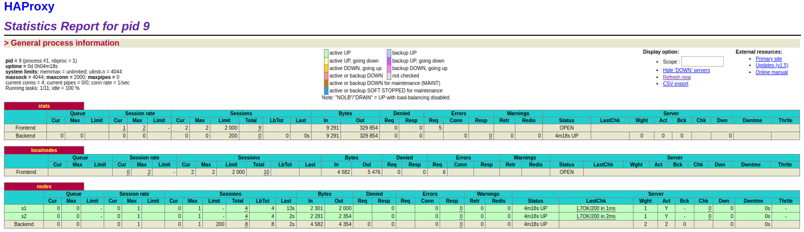
   
2. **Give the URL of your repository URL in the lab report.**

   voici l’url de notre repo : https://github.com/playjul306/Teaching-HEIGVD-AIT-2019-Labo-Docker


## <a name="task-1"></a>Task 1: Add a process supervisor to run several processes

**Deliverables**:

1. **Take a screenshot of the stats page of HAProxy at <http://192.168.42.42:1936>. You should see your backend nodes. It should be really similar to the screenshot of the previous task.**

   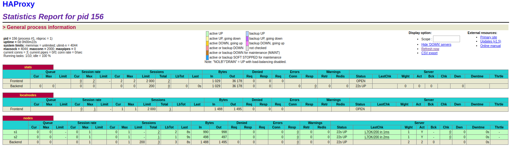
   
2. **Describe your difficulties for this task and your understanding of what is happening during this task. Explain in your own words why are we installing a process supervisor. Do not hesitate to do more research and to find more articles on that topic to illustrate the problem.**

   Nous n’avons eu aucune difficulté lors de la réalisation de cette tâche.

   Le but de cette tâches est de permettre aux conteneurs docker d’executer plusieurs processus grâce au superviseur de processus (`s6-overlay`) ajouté aux images docker. De plus cela nous permet d’éviter que le conteneur se tue une fois un processus terminé.


## <a name="task-2"></a>Task 2: Add a tool to manage membership in the web server cluster

**Deliverables**:

1. **Provide the docker log output for each of the containers: `ha`, `s1` and `s2`. You need to create a folder `logs` in your repository to store the files separately from the lab report. For each lab task create a folder and name it using the task number. No need to create a folder when there are no logs.**
   
   Les fichiers de log de chaque serveur pour chaque tâche se trouvent dans le répertoire `logs/` du dossier du projet comme nous pouvons le voir sur l’image ci-dessous :
   
   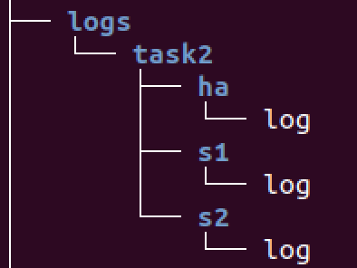

2. **Give the answer to the question about the existing problem with the current solution.**
   
	Le problème de cette solution est qu’on lie le HAProxy avec les webapp avec le flag `—link`, ce qui nous oblige à démarrer les serveurs avant le HAProxy et de devoir redémarrer le HAProxy, ainsi que tous ses noeuds pour chaque ajout de serveur.
   
3. **Give an explanation on how `Serf` is working. Read the official website to get more details about the `GOSSIP` protocol used in `Serf`. Try to find other solutions that can be used to solve similar situations where we need some auto-discovery mechanism.**
   
   **`Serf`** est un outil de gestion de cluster et de détection de panne. Il permet de créer un cluster avec tous ses noeuds afin qu’il puisse communiquer entre eux. Tout cela se fait grâce à l’agent serf installé sur chacun des noeuds, ce qui permet à ces derniers d’être notifié des arrivées et départs de noeuds du cluster.
   
	**`Serf`** permet également de détecter les noeuds défaillants en quelques secondes, d’avertir le reste du cluster et d’executer des scripts de gestion personnalisé permettant de gérer ces événements.
   
	**`Serf`** peut aussi propagé des événements et des requêtes personnalisés vers le cluster. Ces dernières peuvent être utilisées pour déclenché des déploiements ou encore propager des configurations.
   
	**`GOSSIP`** est un protocole de communication basé sur le protocole SWIM, il utilise UDP pour envoyer des messages en broadcast au cluster. C’est grâce à ce protocol Gossip que les prôblème majeur de serf (l'appartenance, la détection et la récupération des pannes et la propagation d'événements personnalisés) sont résolus.
   
	Autres solutions :
   
	- Consul
   	- Etcd
	- Apache ZooKeeper
   
   Sources : 
   
	- https://www.serf.io/intro/index.html
   	- https://www.serf.io/docs/internals/gossip.html
	- https://devopscube.com/open-source-service-discovery/
   
   


## <a name="task-3"></a>Task 3: React to membership changes

**Deliverables**:

1. **Provide the docker log output for each of the containers:  `ha`, `s1` and `s2`. Put your logs in the `logs` directory you created in the previous task.**
   
	Tous les logs de chaque conteneur sont dans leur répertoire réspectif (`logs/task3/<container>`).
   
2. **Provide the logs from the `ha` container gathered directly from the `/var/log/serf.log` file present in the container. Put the logs in the `logs` directory in your repo.**
   
	Le fichier contenant les logs de cette étape se trouve dans (`logs/task3/ha/log-ha-serf`)


## <a name="task-4"></a>Task 4: Use a template engine to easily generate configuration files

**Deliverables**:

1. **You probably noticed when we added `xz-utils`, we have to rebuild the whole image which took some time. What can we do to mitigate that? Take a look at the Docker documentation on [image layers](https://docs.docker.com/engine/userguide/storagedriver/imagesandcontainers/#images-and-layers).**
   **Tell us about the pros and cons to merge as much as possible of the command. In other words, compare:**
   
     ```
     RUN command 1
     RUN command 2
     RUN command 3
     ```
   
     vs.
   
     ```
     RUN command 1 && command 2 && command 3
     ```
   
   La commande `RUN` crée une couche supplémentaire à chaque fois qu'elle est utilisée. Si l’on veut réduire la taille d’une image, il est préférable d’avoir un nombre minimal de couches, donc de commande `RUN` dans le cas présent. De ce fait, le build de l’image se fera plus rapidement.
   
   En contrepartie, lorsque le Dockerfile est composé de plusieurs commandes `RUN`, et donc de plusieurs couches, le méchanisme de mise en cache de docker peut être utilisé pour d’autre images. De plus, utiliser plusieurs commandes à la suite, comme dans le deuxième exemple, réduit la lisibilité du Dockerfile.
   
   **There are also some articles about techniques to reduce the image size. Try to find them. They are talking about `squashing` or`flattening` images.**
   
   `squashing` :
   
   - https://medium.com/tunaiku-tech/squasing-docker-images-dcd5bea8cf09
   - http://jasonwilder.com/blog/2014/08/19/squashing-docker-images/
   
   `flattening` :
   
   - https://tuhrig.de/flatten-a-docker-container-or-image/
   - https://medium.com/@l10nn/flattening-docker-images-bafb849912ff
   
2. **Propose a different approach to architecture our images to be able to reuse as much as possible what we have done. Your proposition should also try to avoid as much as possible repetitions between your images.**
   
   Comme dit lors du point précédent, il est préférable d’utiliser les commandes `RUN` séparément, afin que le mécanisme de mise en cache soit utilisé par les autres images ayant besoin de ces commandes. Toutes les autres devraient être utilisée de manière chainée, comme dans le deuxième l’exemple, afin de réduire le nombre de couche et donc la taille des images.
   
3. **Provide the `/tmp/haproxy.cfg` file generated in the `ha` container after each step.  Place the output into the `logs` folder like you already did for the Docker logs in the previous tasks. Three files are expected.**
   
   Les logs après chaque étape se trouvent dans le dossier `logs/task4/ha/`. les fichiers de log se nomment `ha_cfg-ha`, `ha_cfg-s1` et `ha_cfg-s2`.
   
	**In addition, provide a log file containing the output of the `docker ps` console and another file (per container) with `docker inspect <container>`. Four files are expected.**
   
	Les fichiers de logs contenant ces logs se trouvent dans le dossier `logs/task4/`.
   
   Le fichier contenant la commande `docker ps` se nomme `docker_ps`.
   
	Les fichiers contenant la commandes `docker inspect <container>` se nomment `docker_inspect_ha`, `docker_inspect_s1` et `docker_inspect_s2`
   
4. **Based on the three output files you have collected, what can you say about the way we generate it? What is the problem if any?**

   Le contenu du fichier est écrasé à chaque fois qu’un nouveau noeud rejoint le cluster. Ce dernier contient les informations suivantes :

   - L’id du dernier noeud
   - l’ip du dernier noeud

   Une solution à ce problème serait d’ajouter les nouvelles données à la fin du fichier et de garder le contenu précédent du fichier. 


## <a name="task-5"></a>Task 5: Generate a new load balancer configuration when membership changes

**Deliverables**:

1. **Provide the file `/usr/local/etc/haproxy/haproxy.cfg` generated in the `ha` container after each step. Three files are expected.**
   
   Les fichiers de configurations (`/usr/local/etc/haproxy/haproxy.cfg`) générés après le démarrage de HA, puis de S1 et enfin de S2 se trouvent au chemin suivant : `logs/task5/ha/` et ils se nomment respectivement `ha_cfg-ha`, `ha_cfg-s1` et `ha_cfg-s2`. 
   
   **In addition, provide a log file containing the output of the `docker ps` console and another file (per container) with `docker inspect <container>`. Four files are expected.**
   
	le fichier contenant la sortie de la commmande `docker ps` est le suivant : `logs/task5/docker_ps`. 
   
   les fichiers contanant la sortie de la commande `docker inspect <container>` pour chacun des conteneurs se trouvent au chemin suivant : `logs/task5/` et se nomment respectivement `docker_inspect_ha`, `docker_inspect_s1` et `docker_inspect_s2`. 
   
2. **Provide the list of files from the `/nodes` folder inside the `ha` container. One file expected with the command output.**
   
	la liste des fichiers contenu dans le répertoire `/nodes ` se trouvent au chemin suivant : `logs/task5/ha/nodes`.
   
3. **Provide the configuration file after you stopped one container and the list of nodes present in the `/nodes` folder. One file expected with the command output. Two files are expected.**
   
   le fichier de configuration (`/usr/local/etc/haproxy/haproxy.cfg`) généré après l’arret du conteneur S1, ainsi que la liste des fichiers contenu dans le répertoire `/nodes ` se trouvent dans le répertoire suivant : `logs/task5/ha/` et se nomment respectivement `ha_cfg-s1_stopped` et `nodes-s1_stopped`. 

   **In addition, provide a log file containing the output of the `docker ps` console. One file expected.**

   le fichier contenant la sortie de la commmande `docker ps` après l’arret de S1 est le suivant : `logs/task5/docker_ps-s1_stopped`. 
   
4. **(Optional:) Propose a different approach to manage the list of backend nodes. You do not need to implement it. You can also propose your own tools or the ones you discovered online. In that case, do not forget to cite your references.**

## <a name="task-6"></a>Task 6: Make the load balancer automatically reload the new configuration

**Deliverables**:

1. **Take a screenshots of the HAProxy stat page showing more than 2 web applications running. Additional screenshots are welcome to see a sequence of experimentations like shutting down a node and starting more nodes.**
   
   **Also provide the output of `docker ps` in a log file. At least one file is expected. You can provide one output per step of your experimentation according to your screenshots.**
   
   Nous avons testé notre solution en ajoutant des conteneur et en enlevant pour vérifier si notre load balancer fonctionnait comme nous le voulions.
   
   - Nous avons d’abord ajouté le serveur s1 et avons copié le contenu de la commande `docker ps` dans le fichier `logs/task6/0-docker_ps-s1_started`. Les captures ci-dessous nous montrent le bon fonctionnement de l’application et du load balancer.
     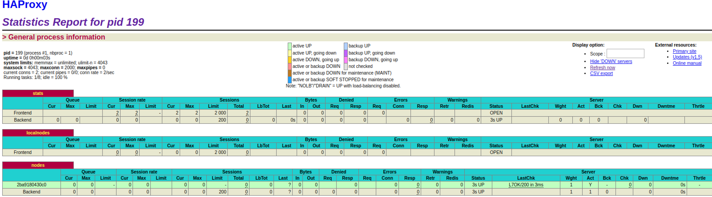
     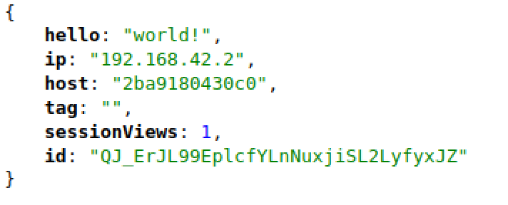
   - Ensuite, nous avons ajouté le serveur s2 et avons copié le contenu de la commande `docker ps` dans le fichier `logs/task6/1-docker_ps-s2_started`. Les captures ci-dessous nous montrent le bon fonctionnement de l’application et du load balancer.
     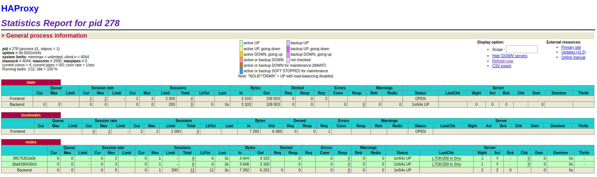
     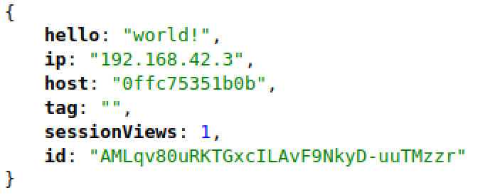
   - Puis, nous avons ajouté le serveur s3 et avons copié le contenu de la commande `docker ps` dans le fichier `logs/task6/2-docker_ps-s3_started`. Les captures ci-dessous nous montrent le bon fonctionnement de l’application et du load balancer.
     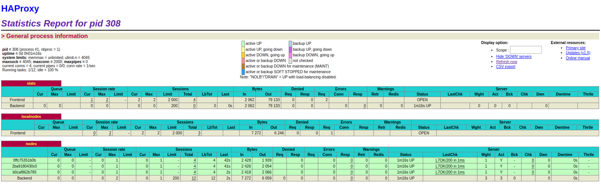
     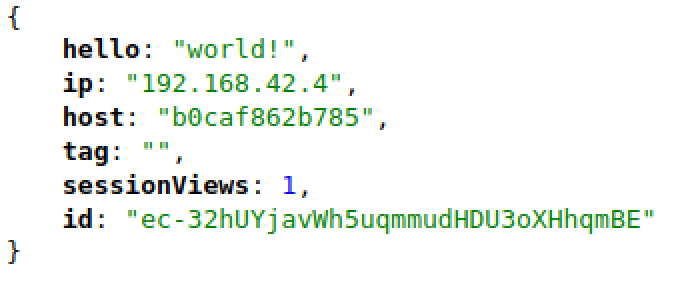
   - Après coup, nous avons arrêté le serveur s3 et avons copié le contenu de la commande `docker ps` dans le fichier `logs/task6/2-docker_ps-s3_stopped`. Les captures ci-dessous nous montrent le bon fonctionnement de l’application et du load balancer.
     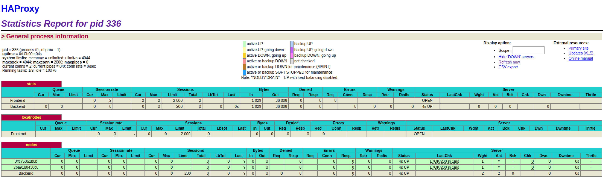
     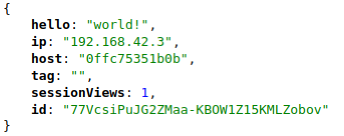
   - Pour finir, nous avons ajouté le serveur s3 et avons copié le contenu de la commande `docker ps` dans le fichier `logs/task6/4-docker_ps-s4_started`. Les captures ci-dessous nous montrent le bon fonctionnement de l’application et du load balancer.
     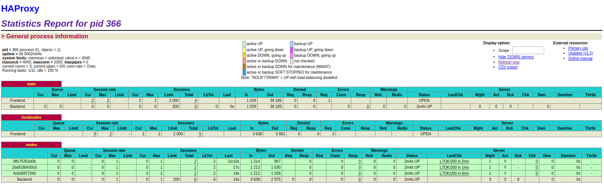
     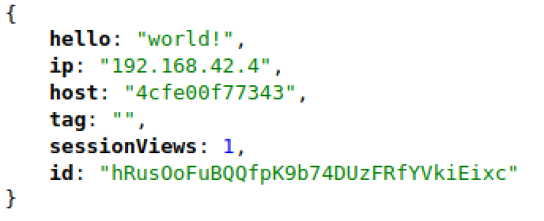
   
   Nous avons donc pu remarquer que le load balancer est capable de gérer automatiquement la suppression et l’ajout de noeuds avec un temps allant de mois d’une seconde à 2 secondes maximum.
   
2. **Give your own feelings about the final solution. Propose improvements or ways to do the things differently. If any, provide references to your readings for the improvements.**
   
   

3. **(Optional:) Present a live demo where you add and remove a backend container.**

## <a name="Difficulties"></a>Difficulties

La seule réelle difficulté que nous avons eu ne concernait pas à proprement dit le contenu du laboratoire, mais son environnement. En effet, nous avons eu un problème avec la machine virtuelle Ubuntu qui n’avait pas assez de stockage pour permettre le lancement des conteneurs et donc nous avons du rajouter du étendre le disque dur virtuelle pour pouvoir commencer le laboratoire, ce qui nous a retarder au départ.

## <a name="Conclusion"></a>Conclusion

Nous avons appris à configurer un HaProxy afin de rendre son environnement dynamique et automatisé en partant d’un environnement totalement statique. Nous avons utilisé des outils comme `s6` et `serf` qui sont nouveaux pour nous et avons pu faire des recherches sur différents outils similaires afin de comprendre exactement ce que nous devions faire.